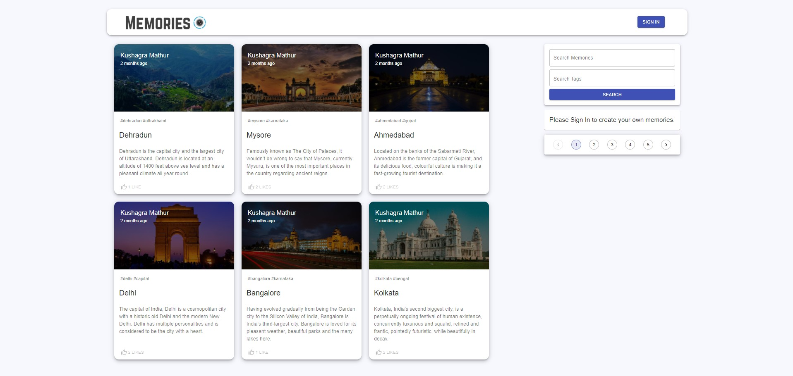

# Blogs Project

Using React, Node.js, Express & MongoDB -- Full Stack MERN Application. The App is called "Memories" and it is a simple social media app that allows users to post interesting events that happened in their lives.

This application includes user authentication, creating, updating and deleting post functionality. User can also like and comment posts.

## Installation

run ``npm i && npm start`` for both client and server side to start the app
    